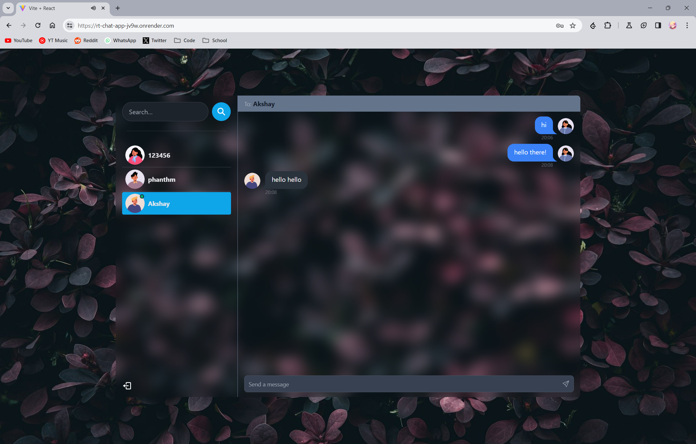

**Chat Application README**
==========================

**Table of Contents**
-----------------

1. [Introduction](#introduction)
2. [Features](#features)
3. [Backend](#backend)
	* [Dependencies](#dependencies)
	* [Routes](#routes)
	* [Database](#database)
	* [Models](#models)
	* [Controllers](#controllers)
	* [Middleware](#middleware)
4. [Frontend](#frontend)
	* [Dependencies](#dependencies-1)
	* [UI Components](#ui-components)
	* [Auth Context](#auth-context)
	* [Hooks](#hooks)
	* [Socket.io Client](#socketio-client)
5. [Installation](#installation)
6. [Usage](#usage)
7. [Deployment](#deployment)
8. [Contributing](#contributing)
9. [License](#license)

**Introduction**
---------------

This is a chat application built with a backend API and a frontend client. The application allows users to sign up, log in, and send messages to each other.

[Visit the website](https://rt-chat-app-jv9w.onrender.com)

**Screenshots**
---------------

### Login

### Signup

### Home

### Conversation

**Features**
------------

* User authentication (sign up, log in, log out)
* Real-time messaging
* User search functionality
* Basic UI components (login page, signup page, sidebar, messages)

**Backend**
------------

### Dependencies

* Node.js
* Express.js
* MongoDB
* Mongoose
* JWT
* Socket.io

### Routes

* `/auth`: authentication routes (sign up, log in, log out)
* `/messages`: message routes (send message, get messages)
* `/users`: user routes (get users)

### Database

* MongoDB is used as the database for storing user and message data.

### Models

* `User`: represents a user in the database
* `Message`: represents a message in the database
* `Conversation`: represents a conversation in the database

### Controllers

* `authController`: handles authentication logic
* `messageController`: handles message logic
* `userController`: handles user logic

### Middleware

* `protectRoute`: middleware that checks if a user is authenticated before allowing access to a route

**Frontend**
------------

### Dependencies

* React.js
* React Router
* React Hot Toast
* Socket.io Client

### UI Components

* `Login`: login page component
* `Signup`: signup page component
* `Sidebar`: sidebar component
* `Messages`: messages component

### Auth Context

* `AuthContext`: provides authentication state and functions to components

### Hooks

* `useSignup`: hook for signing up a user
* `useLogin`: hook for logging in a user
* `useLogout`: hook for logging out a user
* `useSendMessage`: hook for sending a message
* `useGetMessages`: hook for getting messages

### Socket.io Client

* `socket.io-client`: used for real-time communication with the backend

**Installation**
---------------

1. Clone the repository: `git clone https://github.com/your-username/your-repo-name.git`
2. Install dependencies: `npm install`
3. Start the backend: `npm start`
4. Start the frontend: `npm start` (in a separate terminal)

**Usage**
---------

1. Open the application in a browser: https://rt-chat-app-jv9w.onrender.com
2. Sign up or log in to use the application

**License**
---------

This project is licensed under the MIT License.